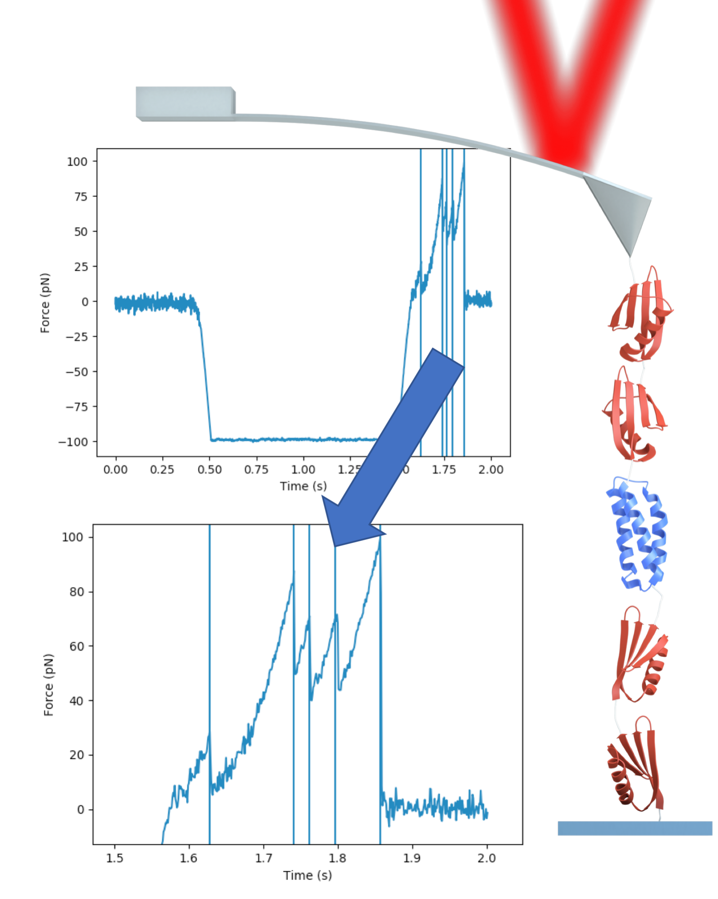
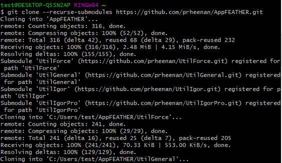
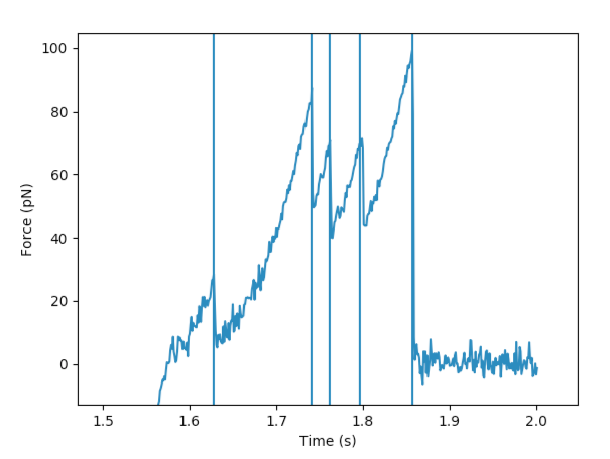

# Description

This repository contains FEATHER (*F*orce *E*xtension *A*nalysis using a *T*estable *H*ypothesis for *E*vent *R*ecognition), a freely available technique for finding rupture events in force spectroscopy data.

# Citing FEATHER

If you use FEATHER, please use the following citation:

xxx

# Video tutorial

The steps in this text document are covered by [this video tutorial](https://www.youtube.com/watch?v=F2N1cFR1FzA "FEATHER video tutorial").

# Installing

## Getting the Repository

To install, in git bash (for windows, https://git-scm.com/downloads) or Terminal (Mac/OS X), type in the following:

git clone --recurse-submodules https://github.com/prheenan/AppFEATHER.git

This will install FEATHER to the current directory.  You should see something like the following:

## Dependencies

Although FEATHER has interfaces for Matlab (tested with version 2017b and 2018a), Igor (tested with 6.37 and 7.04), and Python (tested with 2.7.14), Python 2.7 is needed for FEATHER. The easiest way to install Python 2.7 and the dependencies is the free Anaconda:

https://www.anaconda.com/download

Again, install python2.7 (*not* python3.4). For Matlab and Igor usage, FEATHER assumes there will be a python binary (or .exe for Windows) at:

- "C:/ProgramData/Anaconda2/" (for Windows, no quotes)
- "//anaconda/bin/python2" (for MAC, no quotes)

This is the default for OS X, and also the default for Windows if you choose 'Install for all users', as in this picture:

As of 2018-6, the above paths are the default option for when Anaconda installs. If you install to a different location and use Matlab or Igor, you will need to update the relevant path in the ".m" or ".ipf" (see below).

You will need the following libraries (installed by default by Anaconda)

- numpy
- scipy

## Verifying the install worked 

Whether you installed Anaconda or are using your own custom python, you should make sure all of the needed packages are installed by running the following commands in the install folder. Note that Windows must run this as an administrator (e.g., right click on git bash icon and click 'run as administrator').: 

- "C:/ProgramData/Anaconda2/python.exe setup.py install" (for Windows, no quotes)
- "//anaconda/bin/python2 setup.py install" (for MAC, no quotes)

For example, in the image below, we have installed FEATHER in the home ('~') subdirectory), and we run setup.py. 

# Running the example

Open git bash for Windows (or terminal for Mac). Navigate to the repository installed above. If you type dir (ls for Mac), you should see something like:

$ ls
__init__.py  AppMatlab/  Code/  README.md   UtilGeneral/  UtilIgorPro/
AppIgor/     AppPython/  Data/  UtilForce/  UtilIgor/

Each language (Matlab, Python, and Igor Pro) has an example file which shows FEATHER working on a polyprotein force-extension curve. The files are located in AppYYY, where YYY is the language name. To run in the following languages:

- Matlab:
	- Change to the AppMatlab folder 
		-- Open Matlab, Click 'Run', then click 'Change Folder' when the 'Matlab Editor' dialogue appears
	- Run 'feather_example.m' in the AppMatlab folder
- Igor Pro: 
	- Open 'Example/MainFEATHER.ipf' in the AppIgor folder
	- Run 'ModMainFeather#Main_Windows()' in the command window after compiling
- Python:
	- Run 'main_example.py' from the AppPython folder
	- e.g. For windows type 'C:/ProgramData/Anaconda2/python.exe main_example.py' without quotes for Windows in git bash
	
**You should run the python files first**. Here is an example of run FEATHER in python on a Windows machine:

Running each of the files should result in a plot like the following appearing, with the predicted events marked:

# Running more examples

FEATHER has many more example force-extension curves in the Data subdirectory. If you would lie to run them in Matlab or python, merely change the input file variable from (the default) 'example_0.csv' to whichever file you want to run. In Igor, export one of those .csv files to a .pxp file , as described below. 
	
## Running FEATHER on your own data

It is recommended to run FEATHER through one of the interfaces (python, Matlab, or Igor Pro). These interfaces deal with data management for you. Each example file (Matlab, Python, and Igor Pro, listed above), loads either a pxp or a csv file before calling FEATHER. To run on your data, modify the example to run on your data. In this manner, any data you have loaded in the programming language can be analyzed with FEATHER

You can also run FEATHER directly from the command line. FEATHER's command line arguments can be found by calling the program with -h, as follows:

~~~~			
$:python main_feather.py -h
 usage: main_feather.py [-h] [-tau tau] -threshold threshold -spring_constant
                       spring_constant -trigger_time trigger_time -dwell_time
                       dwell_time -file_input file_input -file_output
                       file_output

Predict event locations in a data file

optional arguments:
  -h, --help            show this help message and exit
  -tau tau              tau fraction of curve (0,1)
  -threshold threshold  probability threshold (0,1)
  -spring_constant spring_constant
                        spring constant of the probe (N/m)
  -trigger_time trigger_time
                        time at which approach ends (s)
  -dwell_time dwell_time
                        time between approach end and retract start (s)
  -file_input file_input
                        path to the force-extension curve file (string)
  -file_output file_output
                        path to output the associated data (string)
~~~~			

 Using the command line, the output file is always written as a single column, with one event index per line. The following example will create the event indices in the file "output.txt" in the current directory.

~~~~
python2 main_feather.py
    -tau 1e-2 \
    -threshold 1e-3 \
    -spring_constant 6.67e-3 \
    -trigger_time 0.382 \
    -dwell_time 0.992 \
    -file_input ../Data/example_0.csv \
    -file_output ./output.txt \
~~~~

Note that '\\' is the line continuation character. FEATHER accepts the following formats for the input file.

### .pxp (Igor Pro) formatting

- Files ending with '.pxp' with names formatted as below. 
    - These are Igor Pro files, and should have a separation, force, and time wave, named like:
	    - "[X][#]Sep", "[X][#]Force", and "[X][#]Time" (without quotes)
		- where "[X]" is any letters, and "[#]" is any digits.
    - For example, "Image0994Time", "Image0994Sep","Image0994Force".
    - If directly using the example .ipf file, the note must have a string like:
        - "TriggerTime:[number],DwellTime:[number],SpringConstant[numbers]" without quotes, where [number] is a value in SI units (*e.g.* 0.123e-6, without brackets) and the values are respectively the end of the approach, the length of the dwell at the surface before retraction, and the spring constant of the force probe.

### .mat (Matlab) formatting

- Files ending with '.mat', formatted like '-v7.3' (see: mathworks.com/help/matlab/ref/save.html#bvmz_n7), with 'time', 'sep', and 'force' data sets. This is essentially an hdf5 file.

### .csv (Generic) formatting

- Files ending with '.csv', where there are three comma-delimited columns of length N, which are the time, separation, and force columns, with the following lines:
    - Line 1: A literal '#', followed by key-value pairs of experimental information, formatted like 'key:value'.
        - For example (and most relevant to FEATHER) 'SpringConstant:0.001,DwellTime:0,TriggerTime:1'
    - Line 2: A literal '#EventIndices,formatted as [[start1,end1],...]:', followed by an csv list of event start and end index pairs, formatted like '[start,end]'
        - For example, '[[1,2],[7,8]]' means two events, where one events starts at index 1 and stops at 2, and the other starts at 7 and ends at 8.
        - Note: all indices are zero-offset into the remaining data in the csv file. In other words, index 0 would mean line 3
    -Line 3 to end: the time, separation, and force as comma-delimited columns. 

## Custom force-extension curves

Some applications (*e.g.* complicated triggering or refolding schemes) may only have a retraction. In this case, a suitable portion of the retraction lacking any events (*e.g.* post-detachment) can be 'pasted' onto the approach. An example of this process is shown in the file AppPython/main_example.py (the function _test_FEATHER_retract_only).

The easiest way to create these custom waves (as demonstrated in the file mentioend above) is as follows:

1. Get the retraction curve
2. Determine the part of the retraction curve without events (often, the last 10-50 percent), which will be called the 'psuedo' approach
3. Prepend the 'psuedo' approach to the retraction.
       - Offset the separation of the 'psuedo' approach so it and the retraction curve have a common zero
       - Adjust the time so that t=0 at point 0 of the prepended data and continues monotonically
       - The total length of the new retraction is now greater than it was before
4. Run FEATHER, with the DwellTime set to 0 and and TriggerTime set to the total length of the 'psuedo' approach

	
## Troubleshooting

- The most common error for Igor and Matlab is an inaccurate Python binary location. 
	-- In the relevant example file, check that the path matches the true path of python
	-- Try 'which python' in Git bash or 'where python' in Terminal
- Be sure that the python example file runs before trying Matlab or Igor Pro. If some part of the python install was bad, then nothing will work.

