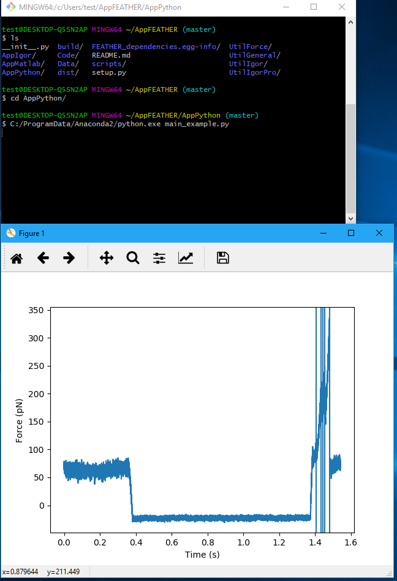

# Description

This repository contains FEATHER (*F*orce *E*xtension *A*nalysis using a *T*estable *H*ypothesis for *E*vent *R*ecognition), a freely available technique for finding rupture events in force spectroscopy data.

# Citing FEATHER

If you use FEATHER, please use the following citation:

xxx

# Installing

## Getting the Repository

To install, in git bash (for windows, https://git-scm.com/downloads) or Terminal (Mac/OS X), type in the following:

git clone --recurse-submodules https://github.com/prheenan/AppFEATHER.git

This will install FEATHER to the current directory.  You should see something like the following:

## Dependencies

Although FEATHER has interfaces for Matlab (tested with version 2017b and 2018a), Igor (tested with 6.37 and 7.04), and Python (tested with 2.7.14), Python 2.7 is needed for FEATHER. The easiest way to install Python 2.7 and the dependencies is the free Anaconda:

https://www.anaconda.com/download

Again, install python2.7 (*not* python3.4). For Matlab and Igor usage, FEATHER assumes there will be a python binary (or .exe for Windows) at:

- "C:/ProgramData/Anaconda2/" (for Windows, no quotes)
- "//anaconda/bin/python2" (for MAC, no quotes)

This is the default for OS X, and also the default for Windows if you choose 'Install for all users', as in this picture:

As of 2018-3-26, the above paths are the default option for when Anaconda installs. If you install to a different location and use Matlab or Igor, you will need to update the relevant path in the ".m" or ".ipf" (see below).

You will need the following libraries (installed by default by Anaconda)

- numpy
- scipy

## Verifying the install worked 

Whether you installed Anaconda or are using your own custom python, you should make sure all of the needed packages are installed by running the following commands in the install folder. Note that Windows must run this as an administrator (e.g., right click on git bash icon and click 'run as administrator').: 

- "C:/ProgramData/Anaconda2/python.exe setup.py install" (for Windows, no quotes)
- "//anaconda/bin/python2 setup.py install" (for MAC, no quotes)

For example, in the image below, we have installed FEATHER in the home ('~') subdirectory), and we run setup.py. 

# Running the example

Open git bash for Windows (or terminal for Mac). Navigate to the repository installed above. If you type ls, you should see something like:

$ ls
__init__.py  AppMatlab/  Code/  README.md   UtilGeneral/  UtilIgorPro/
AppIgor/     AppPython/  Data/  UtilForce/  UtilIgor/

Each language (Matlab, Python, and Igor Pro) has an example file which shows FEATHER working on a polyprotein force-extension curve. The files are located in AppYYY, where YYY is the language name. To run in the following languages:

- Matlab:
	- Change to the AppMatlab folder 
		-- Open Matlab, Click 'Run', then click 'Change Folder' when the 'Matlab Editor' dialogue appears
	- Run 'feather_example.m' in the AppMatlab folder
- Igor Pro: 
	- Open 'Example/MainFEATHER.ipf' in the AppIgor folder
	- Run 'ModMainFeather#Main_Windows()' in the command window after compiling
- Python:
	- Run 'main_example.py' from the AppPython folder
	- e.g. For windows type 'C:/ProgramData/Anaconda2/python.exe main_unit_feather.py' without quotes for Windows in git bash
	
**You should run the python files first**. Here is an example of run FEATHER in python on a Windows machine:

Running each of the files should result in a plot like the following appearing, with the predicted events marked:

	
## Running FEATHER on your own data

It is recommended to run FEATHER through one of the interfaces (python, Matlab, or Igor Pro). These interfaces deal with data management for you. Each example file (Matlab, Python, and Igor Pro, listed above), loads either a pxp or a csv file before calling FEATHER. To run on your data, modify the example to run on your file.

You can also run FEATHER directly from the command line, as described above. FEATHER accepts the following formats:

- Files ending with '.pxp' with names formatted as below. 
    - These are Igor Pro files, and should have a separation, force, and time wave, named like "<X><#>Sep", "<X><#>Force", and "<X><#><Time" (without quotes), where <X> is any letters, and <#> is any digits.
    - For example, "Image0994Time", "Image0994Sep","Image0994Force".
- Files ending with '.mat', formatted like '-v7.3' (see: mathworks.com/help/matlab/ref/save.html#bvmz_n7), with 'time', 'sep', and 'force' data sets. This is essentially an hdf5 file.
- Files ending with '.csv', where there are three comma-delimited columns of length N, which are the time, separation, and force columns. 

All units are assumed SI (seconds, meters, and newtons)
	
## Troubleshooting

- The most common error for Igor and Matlab is an inaccurate Python binary location. 
	-- In the relevant example file, check that the path matches the true path of python
	-- Try 'which python' in Git bash or 'where python' in Terminal
- Be sure that the python example file runs before trying Matlab or Igor Pro. If some part of the python install was bad, then nothing will work.

